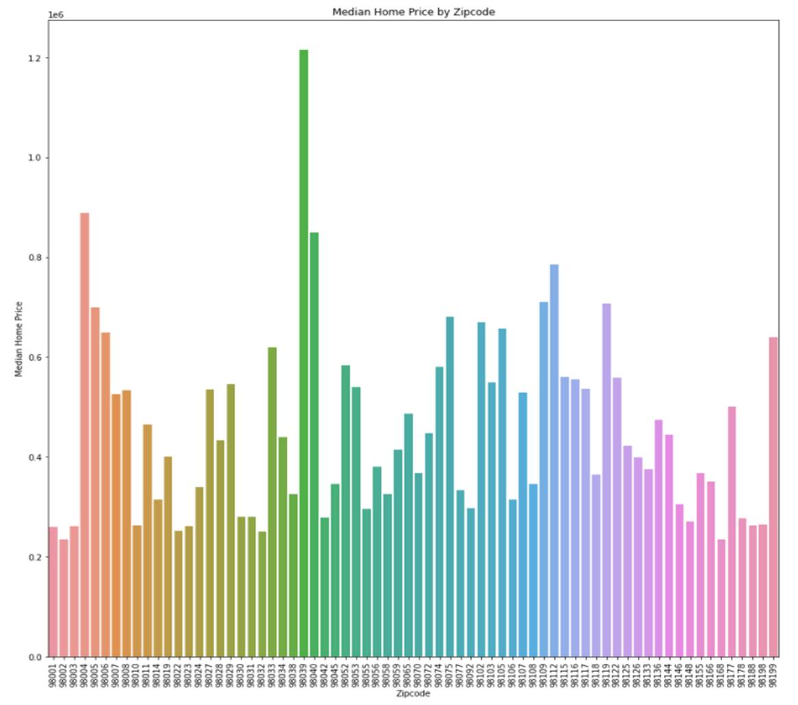
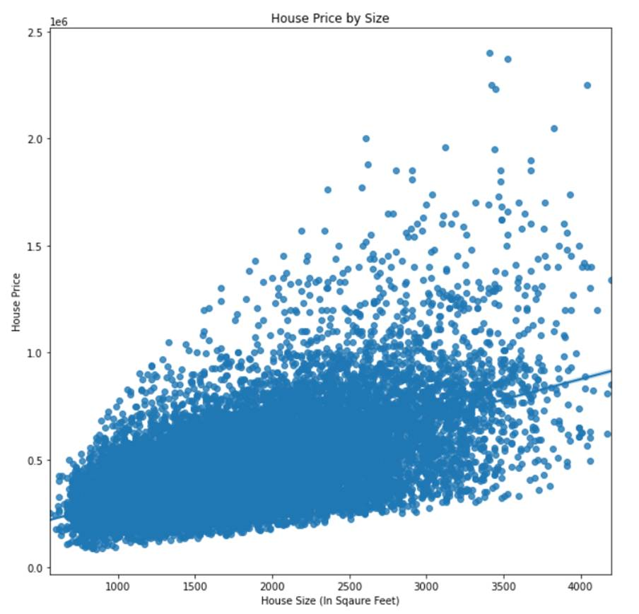

# Module 2 Final Project
## Maximizing Profits in Home Sales

This project attempted to identify the important factors in accurately predicting home price.

## Business Problem

The insights provided by this model were used to present the factors influential in selling homes and maximizing profit.

## Data

The data used in this project comes from home sales in King's County, Washington in 2014 and 2015. The data is found in this repository. 

## Methods

The data were analyzed using statsmodel's ordinary least squares regression to create a model that could most accurately predict house prices from the variables in the dataset. 

## Results

Location, represented here by zipcode, is very important to determining home price, with different areas having vastly different median prices. 

The strongest way a home owner can increase their home price is by making the house bigger. 

## Recomendations

This model dropped the information about the size of surrounding houses, number of bathrooms, month sold, and the size of the house excluding the basement. The most important features include zipcode, square footage of the house, and the grade given by King's County.

## Limitations

I initially attempted to refine my model using variance inflation factor to decide which variables to eliminate. However the identified correlated variables did not match what was found using a heatmap to display the correlations between the variables. There were also issues meeting the assumptions. Thus using r-squared values became the primary method for determining the model's strength.